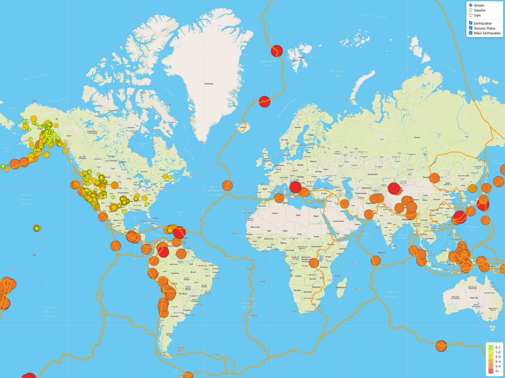

# Mapping_Earthquakes

## Overview

In this project, we used Leaflet.js to create maps and presented the earthquake data from the USGS. We retrieved the data from the GeoJSON file, made API requests to Mapbox, got geographical maps, and created multiple map layers. In the challenge, we presented the earthquake data in relation to the tectonic plates’ location. The layer of earthquakes with a magnitude greater than 4.5 was added to the map.

## Results

Our final map was as follows:

- It had three map styles: Streets, Satellite, and Dark version.
- Three layers were added to the map: Earthquakes, Tectonic Plates, and Major Earthquakes.
